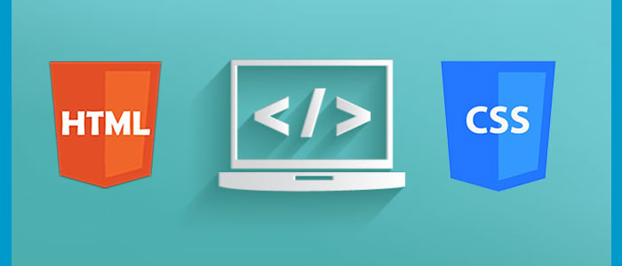

# Html e CSS.

O segredo de um site profissional é ter como base um bom HTML. Mais que conhecer todos os elementos do HTML, é saber a importância de um código semântico e bem estruturado. Além disso, entender o papel do CSS em potencializar as informações do HTML, estruturando em layouts de colunas e linhas, além dos devidos destaques visuais, como cores, fontes, tamanhos e mais recursos. Aqui, você entenderá do que se constitui os fundamentos para o desenvolvimento de uma página para Web.

## [Parte 1](https://cursos.alura.com.br/course/html5-css3-primeiros-passos)

* O que é HTML e CSS.
* Estrutura básica do HTML.
* Aprender a inspecionar elementos.
* Definir estilos para elementos usando CSS.
* Desenvolver uma página web.

## [Parte 2](https://cursos.alura.com.br/course/html5-css3-posicionamento-listas-navegacao)

* Estrutura da página HTML.
* Navegação entre páginas.
* Reset.css e posicionamento com CSS.
* Diferença entre inline e block.
* Bordas e pseudo-classes CSS.

## [Parte 3](https://cursos.alura.com.br/course/html5-css3-formularios-tabelas)

* Formulários complexos.
* Campos para celulares.
* Informações em tabelas.
* Estilos para formulários, campos e tabelas.
* Hierarquia no CSS.
* Transformações e transições CSS.

## [Parte 4](https://cursos.alura.com.br/course/html5-css3-avancando-css)

* Importe conteúdo externo na página HTML, fontes, vídeos e mapas.
* Pseudo-classes e pseudo-elementos.
* Seletores CSS Avançados.
* Opacidade e sombra.
* Viewport e design responsivo.
